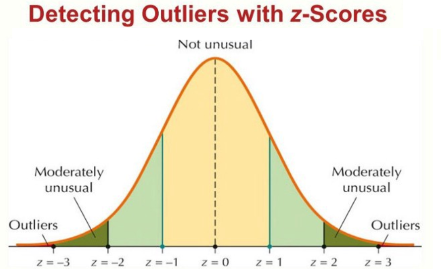
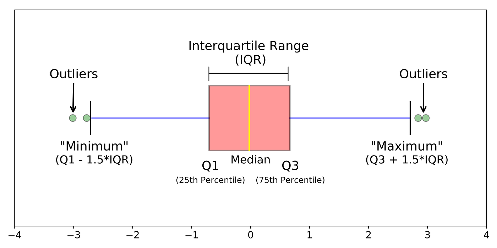
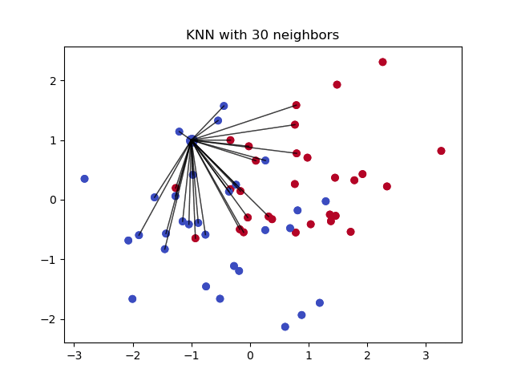
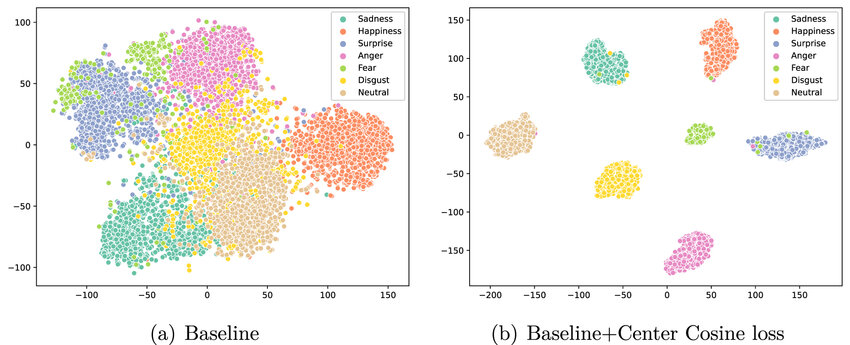
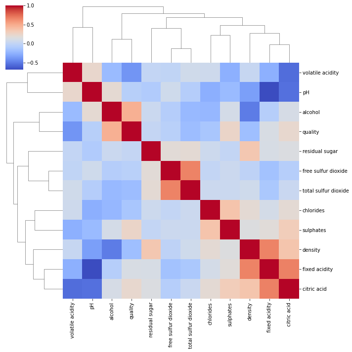
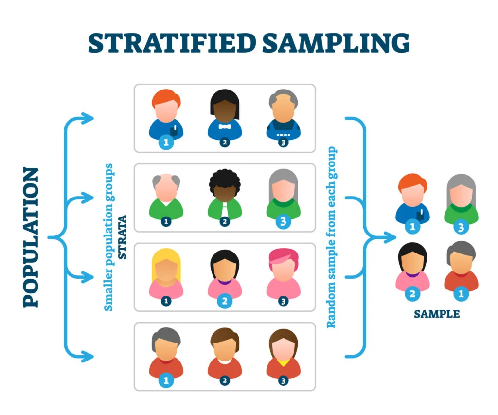
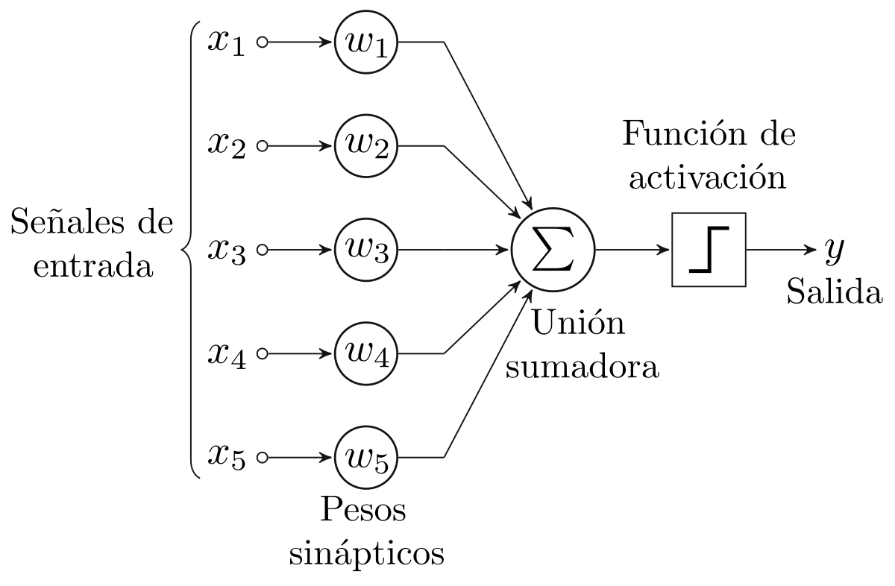
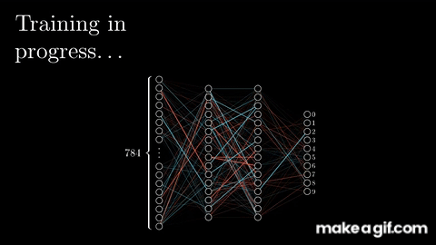

# Classical Machine Learning 3 🚀

## Index
1. Advanced Techniques on Data  
    - Advanced Data Cleaning Techniques  
        - Outlier Removal  
        - Imputation of Missing Values  
    - Dimensionality Reduction Techniques  
        - Principal Component Analysis (PCA)  
        - t-Distributed Stochastic Neighbor Embedding (t-SNE)  

2. Advanced Plotting Techniques  
    - Advanced Visualization Techniques  
        - Heatmaps, Pairplots  
    - Time Series Analysis and Visualization  
        - Plotly & Seaborn  
    - Optimizing Visualization for Large Volumes of Data  

3. Pipelines  
    - Automated Pipelines for Data Cleaning and Preprocessing  
    - Implementing Pipelines with scikit-learn and pandas  
        - Steps for Effective Pipeline  

4. Neural Networks  
    - Perceptron  
    - Neural Network


## 1. Advanced Techniques on Data

### Advanced Data Cleaning Techniques

Let’s revisit one of the first topics we covered: Data Cleaning.

In the initial presentation, we cleaned the data using print statements and manual inspection. This approach worked because the dataset was small. However, with larger datasets, manually checking everything becomes impractical. Instead, we need faster and more automated methods to identify and fix issues like outliers and missing values.

#### A) Outlier Removal

There are two common and easy statistical methods to detect outliers: **Z-score** and **Interquartile Range (IQR)**.

- **Z-score Method** 
  Measures how far a data point is from the mean in terms of standard deviations.
  - If the Z-score is \|Z\| > 3 (greater than 3 or less than -3), the data point is typically considered an outlier.  
  - This method assumes a normal distribution and works well when the data is symmetric.
<kbd></kbd>

- **IQR Method**  
  'The Interquartile Range' focuses on the middle 50% of the dataset.  
  - It defines a "normal" range and treats anything significantly smaller or larger as a potential outlier.  
  - The IQR is calculated as:  
    - \[ Q1 - 1.5 * IQR, Q3 + 1.5 * IQR \]  
    - Where **Q1** is the 25th percentile and **Q3** is the 75th percentile.
  - Values outside this range are considered outliers.
  <kbd></kbd>

  #### When to Use Each Method  
  - Use **Z-score** if your data is **normally distributed**, as it relies on the properties of the normal distribution.  
  - Use **IQR** if your data is **skewed** or contains many extreme values, as it is more robust to non-normal distributions and outliers.

#### B) Imputation of Missing Values

There are two commonly used statistical methods to fill in missing values: **Mean/Median/Mode Imputation** and **K-Nearest Neighbors (KNN) Imputation**.

- **Mean / Median / Mode Imputation**
  When a dataset contains missing values (NaNs), one of the simplest techniques is to replace them with a central tendency measure from the same column:  
  - **Mean** – appropriate for normally distributed numerical data.  
  - **Median** – more robust to outliers and skewed distributions.  
  - **Mode** – used for categorical or discrete variables.

  This method is fast and easy to implement but doesn't account for relationships between features.

- **K-Nearest Neighbors (KNN) Imputer**  
KNN imputation is a more advanced and data-aware approach.  
Instead of using a single static value, KNN uses the values from the K neighbors(most similar) based on the other features.

  **How it works:**

  1. **Find similar rows:**  
    For the row with the missing value, KNN identifies other rows with similar values across the remaining columns.  
      - Similarity is measured using a distance metric, Euclidean distance.

  2. **Pick K neighbors:**  
      - Choose the *K* closest rows (neighbors).

  3. **Fill the missing value:**  
      - If the missing value is **numerical**, take the **average** of the neighbors’ values.  
      - If the missing value is **categorical**, take the **most frequent** category among the neighbors.

  <kbd></kbd>

    KNN imputation takes into account relationships between different features, making it more accurate but also more computationally expensive.

--- 

### Dimensionality Reduction Techniques

When working with datasets that have many features, it becomes more difficult to visualize, process, and model the data.  
**Dimensionality reduction** helps by reducing the number of features while retaining as much important information as possible.

There are two main types of techniques:  
- **Linear:** PCA
- **Non-linear:** t-SNE

#### A) Principal Component Analysis (PCA)

PCA is a **linear** dimensionality reduction method that transforms a dataset with many columns into a smaller set of new columns, called **principal components**. These components retain the most significant patterns or variance in the data.

  - **How PCA Works (Step-by-Step)**
    1. Standardize the Data 
        - Each feature is scaled so they contribute equally to the analysis.

    2. Find Directions Where the Data Varies Most
        - PCA identifies the directions (principal components) where the data is most spread out.  
        - More spread (variance) = more "interesting" or informative.

    3. Create New Axes (Principal Components
        - These new axes are **linear combinations** of the original features.  
        - The **first principal component** captures the most variance.  
        - The **second principal component** captures the next most variance, and is orthogonal (independent) to the first.

    4. Drop Unimportant Information
        - You can now choose to keep just the top few components (e.g., 1, 2, or 3) instead of all original features.  
        - This makes your dataset smaller, faster to process, and easier to visualize—without losing much critical information.

  <kbd></kbd>

- **Key Points to Remember**
  - **First principal component** = captures the most variance.  
  - **Second principal component** = captures the next most variance and is **orthogonal** to the first.  
  - PCA is a **linear method**, meaning it assumes relationships between features are straight-line (not curved).

- **Simple Example:**

  Imagine you have students' scores in **Math** and **Science**, and those two scores are strongly related.

    - PCA would find a new axis like **"Overall Academic Strength"**, which is a combination of Math and Science scores.  
    - This makes it easier to understand overall performance without having to look at both subjects separately.

#### B) t-Distributed Stochastic Neighbor Embedding (t-SNE)

t-SNE is a **non-linear** dimensionality reduction technique designed to help visualize complex, high-dimensional data in **2D or 3D**. Its primary goal is to preserve local structure: points that are close together in the high-dimensional space should remain close in the low-dimensional map.

  - **How t-SNE Works (Step-by-Step)**
    1. Find Similar Points
      - t-SNE analyzes the original high-dimensional dataset and determines which data points are similar.  
      - "Similar" means that the points are close together based on feature values

    2. Create a New Map
      - It then attempts to map those points into 2D or 3D space while preserving their relative similarities.  
      - Points that were close in the original space will still be close in the reduced space, and distant points will remain distant.

    3. Spread Out the Points  
      - To prevent points from piling on top of each other, t-SNE uses a **t-distribution** rather than a Gaussian distribution.  
      - This helps spread the points out more effectively and highlights the clustering structure.

<kbd></kbd>

- **Key Things to Know**

  - t-SNE is best for revealing clusters of similar data points.
  - t-SNE assumes that relationships between features can be curved or complex, not just linear
  - t-SNE is mainly used to **visualize** high-dimensional data and not typically used as a preprocessing step for model training
  - t-SNE can be **slow on large datasets** unless parameters are tuned for performance.

- **Simple Example**

  Imagine you have animal data with three features: **height**, **weight**, and **speed**.

  - t-SNE reduces this 3D data into a 2D plot.  
  - Similar animals (cheetahs and leopards) will appear **close together**.  
  - Very different animals (whales and birds) will appear **far apart**.

  This visualization helps you understand the structure of the data—even if it's originally in 100+ dimensions.

## 2. Advanced Plotting Techniques

When working with complex datasets, basic charts often aren’t enough to fully understand the data, this is where advanced visualizations can help you:

- See relationships between multiple features at once  
- Identify patterns, clusters, and outliers  
- Better understand high-dimensional data  

### A) Heatmaps

A *heatmap* uses color to represent the strength of relationships between variables.  
It’s commonly used to display *correlation matrices*, which show how strongly pairs of variables are related.

**Why use it?**  
- Quickly spot features that are strongly related  
- Useful for *feature selection* and EDA

<kbd></kbd>

**How to read it:**
- **Darker or more intense colors** → Stronger relationships  
- **Lighter colors (close to white)** → Weaker or no relationships  
- **Positive correlation** → Both variables increase together  
- **Negative correlation** → One variable increases while the other decreases  


### B) Pairplots

A *pairplot* displays scatter plots for every pair of features in a dataset.  
It also shows **Kernel Density Estimation (KDE) plots** on the diagonals to represent individual feature distributions.

**Why use it?**  
- Visually compare every feature against every other feature  
- Identify potential clusters, linear relationships, and outliers  
- Very useful for **classification problems**

<kbd></kbd>

**How to read it:**
- Look at how the points are grouped  
- A clear line or cluster → Strong relationship between the two features  
- Clusters or separations in color → Good indicators of class separability

| Technique | Purpose                       | Best for...                      |
|-----------|-------------------------------|----------------------------------|
| **Heatmap** | Show feature relationships     | Correlation analysis              |
| **Pairplot** | Compare all feature pairs     | Finding patterns and clusters     |

---
### Time Series Analysis and Visualization

#### A) Time Series Analysis

A *time series* is data collected over time: daily, monthly, or yearly.  
*Time Series Analysis* focuses on identifying trends, recurring patterns, and irregularities in data over time. For Example: 

- Daily stock prices  
- Hourly temperature readings  

**Key components to look for:**
- *Trend*: Long-term upward or downward movement in the data  
- *Seasonality*: Repeating patterns at regular intervals (holiday sales spikes in December)  
- *Noise*: Random variation that does not follow a pattern

**Why it's useful:**
- Forecast future values  
- Detect anomalies or unusual events  
- Understand underlying behavior or change over time

#### B) Visualization Tools: Plotly & Seaborn

Both Plotly and Seaborn can help visualize time series data, but they serve different needs.

- **Plotly for Time Series**
    *Plotly* is a powerful library for creating *interactive visualizations*.

    **Why use Plotly?**
    - Zoom, pan, and hover to explore data   
    - Great for dashboards and web apps
    - Supports advanced features like sliders, animation frames, and range selectors

    **Best for:**
    - Interactive dashboards  
    - Presentations where viewers need to explore the data  
    - Large-scale, dynamic datasets

- **Seaborn for Time Series**

    *Seaborn* is a high-level wrapper over Matplotlib, ideal for *static visualizations*.

    **Why use Seaborn?**
    - Quick and easy for making clean, professional-looking plots  
    - Works well for academic reports and scientific papers  
    - Ideal when you don’t need interactivity

    **Best for:**
    - Fast, static, and clean visuals for written reports
    - Simpler, small-to-medium datasets

| Tool     | Best For                                         |
|----------|--------------------------------------------------|
| **Plotly** | Interactive time series plots for large datasets |
| **Seaborn** | Fast, clean static charts for reports or papers |

### C) Optimizing Visualization for Large Volumes of Data

When working with massive datasets (millions of rows or many features), visualizations can become slow to render, messy and hard to interpret, or even cause your computer to crash.

To avoid these issues, we use techniques to make charts *faster*, *cleaner*, and more *informative*, without losing key insights.

#### Solutions for Optimizing Big Data Visualizations

1. **Sampling the Data**  
   Instead of plotting every single data point, you can work with a smaller, representative subset.  
   - **Random Sampling**: Select a random group of points.  
   - **Stratified Sampling**: Ensure the sample maintains the same proportions of different classes (useful for classification).

<kbd></kbd>

2. **Dimensionality Reduction**  
   If your dataset has too many features use reduction techniques to simplify it:  
   - **PCA (Principal Component Analysis)** – for linear feature reduction  
   - **t-SNE (t-distributed Stochastic Neighbor Embedding)** – for uncovering non-linear patterns

3. **Aggregating the Data**  
   Instead of plotting raw data points, summarize the information into meaningful groups:  
   - Averages  
   - Totals
   - Counts 
   - Binned groups (day, week, or category)

   **Example:**  
   Instead of plotting 1 million raw sales transactions, show the *average sales per day*.  
   This reduces clutter but keeps key trends.

#### Why These Techniques Help

- Reduce load time and memory usage  
- Improve readability  
- Preserve important patterns and trends  
- Allow exploration of big data even with limited computing resources

| Problem            | Solution                              |
|--------------------|---------------------------------------|
| Too many points    | Random or stratified sampling         |
| Too many features  | Dimensionality reduction (e.g., PCA)  |
| Messy charts       | Aggregate data (group and average)    |

---

## 3. Pipelines

### Implementation of Automated Pipelines for Data Cleaning and Preprocessing

In real-world machine learning projects, data cleaning and preprocessing are often the most **time-consuming and repetitive** tasks.

To solve this, we use **automated pipelines** — organized sequences of steps that clean, preprocess, and transform data in a consistent and automated way.

### What Is a Pipeline?

A *pipeline* is a structured workflow that automates each step in the data preparation process.  
Instead of writing code for each transformation manually, pipelines let you *link* all your preprocessing tasks into one clean and repeatable process.

**Typical pipeline steps include:**
- Imputing missing values  
- Scaling numerical features  
- Encoding categorical variables  
- Feature selection  
- Any other transformation before modeling

### Benefits of Pipelines

- **Save Time**: Reusable pipelines dramatically reduce data prep time.  
- **Consistency**: Ensures the same transformations are applied every time, reducing the risk of mistakes.  
- **Shareability**: Pipelines can be shared across teams (especially in scikit-learn).  
- **Extendability**: You can easily add or remove steps as needed.

#### Scikit-learn Pipeline

```python
from sklearn.pipeline import Pipeline
from sklearn.impute import SimpleImputer
from sklearn.preprocessing import StandardScaler, OneHotEncoder
from sklearn.compose import ColumnTransformer
from sklearn.ensemble import RandomForestClassifier

# Define preprocessing for numerical and categorical features
numeric_features = ['age', 'income']
numeric_transformer = Pipeline(steps=[
    ('imputer', SimpleImputer(strategy='mean')),
    ('scaler', StandardScaler())
])

categorical_features = ['gender', 'education']
categorical_transformer = Pipeline(steps=[
    ('imputer', SimpleImputer(strategy='most_frequent')),
    ('encoder', OneHotEncoder(handle_unknown='ignore'))
])

# Combine into a full preprocessor
preprocessor = ColumnTransformer(transformers=[
    ('num', numeric_transformer, numeric_features),
    ('cat', categorical_transformer, categorical_features)
])

# Add model to pipeline
clf_pipeline = Pipeline(steps=[
    ('preprocessor', preprocessor),
    ('classifier', RandomForestClassifier())
])

# Fit the pipeline
clf_pipeline.fit(X_train, y_train)
```

---
## 4. Perceptrons and Neural Networks

*Perceptrons* are the building blocks of neural networks.  
- A **single-layer perceptron** is often simply called a *neural network*.  
- A **multi-layer perceptron** is typically referred to as a *neural network* (plural).  

Neural networks, which are a subset of machine learning, provide the foundation for *deep learning*.  
They are inspired by the structure and functioning of the human brain, mimicking how biological neurons transmit signals.

### What is a Perceptron?

A *Perceptron* is the most basic form of a neural network.  
It is a *binary classifier* that outputs either 0 or 1.  
It can only solve problems where data is *linearly separable* (it can be separated by a straight line).

<kbd></kbd>

### Components of a Perceptron

- **Input Features**: Data fed into the model.  
- **Weights**: Determine the importance of each input feature.  
- **Bias**: A constant added to shift the output.  
- **Net Sum**: Weighted sum of inputs plus the bias.  
- **Activation Function**: Determines if the neuron "fires" — adds non-linearity.

### Why Are Weights and Bias Important?

- **Weights** indicate the strength of influence each input has.  
  - Large weights = more influence  
  - Positive weight = direct relationship  
  - Negative weight = inverse relationship  
- **Bias** shifts the decision boundary and helps the model fit the data better.

### Why Do We Need Activation Functions?

Activation functions determine whether the output is activated, They allow neural networks to model complex, non-linear relationships.  
Without them, the perceptron would behave like a simple linear model.

**Common Activation Functions:**
- **Sigmoid** – Used for binary classification (output between 0 and 1)  
- **ReLU** (Rectified Linear Unit) – Used in hidden layers for deep learning  
- **Softmax** – Used for multiclass classification problems

### Perceptron Models Explained

#### Single-Layer Perceptron (SLP)

- Simplest form of a neural network  
- Solves only *linearly separable* problems  
  - Works for: AND gate  
  - Fails for: XOR gate  
- *Feed-forward network*: Data flows only forward, no loops  

#### Multilayer Perceptron (MLP)

- More powerful; built by stacking multiple layers of perceptrons  
- Can model *non-linear* and *complex* problems

<kbd></kbd>

**Two Key Phases:**

1. **Forward Propagation**  
   - Inputs move forward through each layer  
   - Each layer processes and passes the result to the next  
   - Final prediction is made  

2. **Backward Propagation**  
   - The network calculates the error (difference between predicted and actual values)  
   - It updates weights and biases from *output back to input*  
   - This is how the model learns and improves

<kbd></kbd>


*Backpropagation* is the core technique enabling learning in modern neural networks.

### Neural Networks: Foundation of Deep Learning

Neural networks are the basis for more advanced deep learning architectures:

- **Convolutional Neural Networks (CNNs)** – Used in image recognition and computer vision  
- **Recurrent Neural Networks (RNNs)** – Ideal for time series, sequences, and text  
- **Transformers** – Power modern language models like *ChatGPT*

